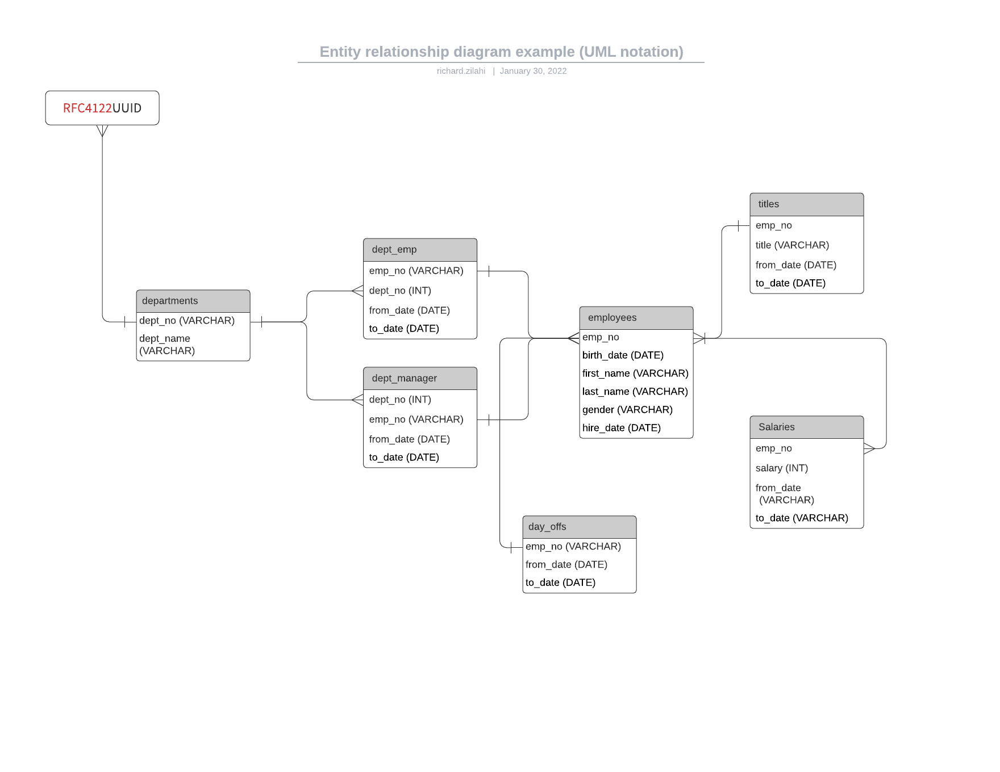

# SQL Assignment

This document is written as the documentation for the Information Management and Databases R0279-3003 course at Laurea

## Introduction

The assignment was to create an SQL schema, some mock data, and execute a couple of queries on the database.

I solved this task by wrapping all the requirements into a `nodejs` application.

## Solution

The application solve all fo the following:

1) creating the database, from an `SQL` file.
2) creating random test data for every table using `faker.js`
4) writing the generated test data into `JSON` files
3) inserting all the test data into their tables, using `node-mysql` interface.
4) running all the testcases, which satisfies every requirements the cours has set.

## Schema

The database lies on the following schema:



Notice the mark for the `rfc4122` which delcared as `VARCHAR` Data type, for every `*_no`. Since in the assignment it was given to have an idea for an application, so I kept in mind to help with different type of integration.

I know in `MySQL` it's common to have the `ID` olumns to set an auto-incrementing INT column, however, for example if I want to connect the employees table to a 3rd party authentication solution (such as `AWS Cognito`) it would require an additional mapping table, which makes the database structure less scalable. So I've went using `UUID` everywhere, where some type of `ID` was needed.

Storing date as `DATE` type also has it's own limitation, for example the format. 

> MySQL retrieves and displays DATE values in ' YYYY-MM-DD ' format.

The `DATETIME` is better, however that's also _formatted_ in the way that it's stored bith the Date and the Time formats, which makes it hard to get it formatted to different locales, without additional steps. When it comes to storing dates, I am using `UNIX` timestamp format, which is `BIGINT` data type in `MySQL`.

However, to satisfy the requirements to have a `DATE` column, there is one in the `days_off` table. Still, `UNIX` timestamp would have been a better solution here too.

## Getting starteds

### Requirements

- git
- nodejs (>=16)
- docker
- access to shell


1) First clone this repo. 

2) hit `npm insall` in the root of the project directory.

3) before we going further let's take a look at the `MySQL` solution.

### Docker

There's a `docker-compose` in this project. As I am working with a set of different databases, and technologies, I am using dockers, to separate my working environment, therefore I *don't* have any `MySQL` installed on my computer. 

Instead, there's a docker file, which set's up a `MySQL` isntance and launches it inside of a container. Besides having a proper `MySQL` instance runnnig, the `docker-compose` file also takes care of the rest, such as:

- setting up a user for the `MySQL`
- exposing it's port and the data volume, so it will be accessible from `localhost`.

To get the `MySQL` up and running, you need to have `Docker` installed on your computer. Once this requirements satisfied, you'll just:

```
docker-compose up -d
```

### Implementation

The application is implemented using pure `Javascript`, with using just a set of external dependencies, such as: 

1) faker - to generate random data
2) lodash – using it's `template` function to prepare executable `SQL` queries.
3) date-fns - to help formatting random date for test data, and for queries
4) random - to generate random data types
5) mysql - using the _official_ `MySQL` driver written for `nodejs`.
6) uuid - to generate random `rfc4122` ids.

Once 

### Creating the database

Once the docker container is up and running, you need to create the database. I've created a `shell` script for that, which will login to the `MySQL` database using it's `CLI` interface. 

To execute this, you just need to simply run: 

```
npm run create-database
```

When it successfully executed, the output should look like something like this: 

```
➜  sql_assignment git:(main) ✗ npm run create-database

> sql_assignment@1.0.0 create-database
> sh ./setup.sh

+ echo '### STARTING UP SCRIPT ###'
### STARTING UP SCRIPT ###
+ docker exec -i sql_assignment_db_1 mysql -u user -pDemoPassword
mysql: [Warning] Using a password on the command line interface can be insecure.
+ echo '### DONE CREATING THE DATABASE###'
### DONE CREATING THE DATABASE###
```

Once this is done, the next step is to execute the main function of this `nodeJs` app, which will

1) create the random set of test data for every table
2) writes them into separate `JSON` files
3) inserts all these test data into the corresponding tables

To run this script just hit:

```
npm run start
```

Once it's successfully run, the output should look like this:

```
> sql_assignment@1.0.0 clean:random
> rimraf ./data/*.json

Starting Script
Starting generating random data
Generating random data for: employees
✅ Generating random data for: employees is done!
Writing random data into file: employees.json
✅ Writing random data into file: employees.json is done!
...
...
All mock data is now ready
Starting insering random data into the database
Inserting data into table employees
Inserting data into table departments
...
...
✅ Inserting data into database is done
```

At this point we have the 

1) database up and running
2) the demo data up and running

It's tieme to run the testcases.

### Testcases

There are alltogether 1 test suite including 39 testcases implemented. The testcases are implemented in the most widely known and used testing framework called `Jest`.

Every testcase is to satisfy all the requirements which were set in this cours.

```
  connection to the database
    ✅ is successful (11 ms)
  necceseary tables exists
    ✅ table: employees exists (4 ms)
    ✅ table: departments exists (2 ms)
    ✅ table: dept_emp exists (2 ms)
    ✅ table: dept_manager exists (2 ms)
    ✅ table: titles exists (2 ms)
    ✅ table: salaries exists (2 ms)
    ✅ table: days_off exists (2 ms)
  required data types exists
    ✅ Data type: VARCHAR exists (16 ms)
    ✅ Data type: INT exists (14 ms)
    ✅ Data type: DATE exists (16 ms)
    ✅ Data type: BIGINT exists (14 ms)
  all tables has Primary Keys set
    ✅ having Primary Key set for table: employees (3 ms)
    ✅ having Primary Key set for table: departments (3 ms)
    ✅ having Primary Key set for table: dept_emp (2 ms)
    ✅ having Primary Key set for table: dept_manager (3 ms)
    ✅ having Primary Key set for table: titles (2 ms)
    ✅ having Primary Key set for table: salaries (2 ms)
    ✅ having Primary Key set for table: days_off (2 ms)
  10 different queries should be created
    ✅ select from employees (15 ms)
    ✅ seelct from employees (8 ms)
    ✅ select from salaries where not null (2 ms)
    ✅ select max salaries from salaries (1 ms)
    ✅ select AND (10 ms)
    ✅ select OR (7 ms)
    ✅ select AS (2 ms)
    ✅ GROUP BY (2 ms)
    ✅ HAVING (4 ms)
    ✅ LEFT JOIN (730 ms)
    ✅ RIGHT JOIN (6 ms)
    ✅ INNER JOIN (5 ms)
```

To execute the tetcases, just run:

```
npm run test
```

The output of this script should be exactly the same as above. Once every testcase has passed, that means that every requirement has met in the assignment.

# Self evalutation

Every requirement is met whcih was set in the assignment. There's random data generation, and the schema as well the random data is also part of this repo. I'd give myself the maximum amount of points.s